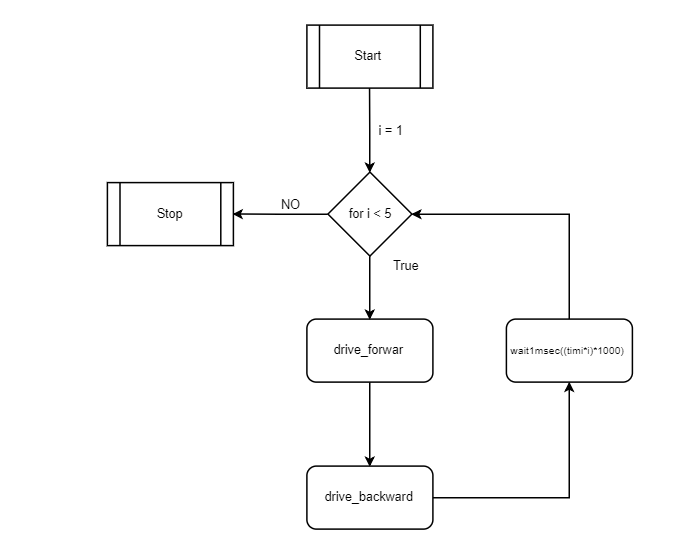

# Verkefni 2

## Hluti 1

Hlut1 snerist um að nota tíma til að láta robitinn fara áfram um 50 cm og aftur um 50 cm 5 sinnum, og hækka vegalengdina með 50 cm í hvert skipti.
Þessi liður var frekar léttur að leysa en var góður inngangur fyrir áfangann.

#### Flowchart


#### Myndband

<a href="https://www.youtube.com/watch?v=lG1IULf8ywg&feature=youtu.be" target="_blank"></a>

## Hluti 2

Hluti2 var svipaður og fyrsti hlutinn, en í honum átti maður að nota vegalengd. Þetta leit út fyrir að vera létta og allt var að virka nema að hann var að keyra skakkt. Okkur leist ekki á það og reyndum að finna leið til að laga það, við ákvöðum að hafa void sem lætur robotinn keyra beint, það er hér fyrir neðanann.
```c
void DriveStraight(bool att)
{
    if (abs(SensorValue[rightEncoder]) + 20 < abs(SensorValue[leftEncoder])){
        if (att){
            motor[rightMotor] = FullPower+10;
            motor[leftMotor] = (FullPower-10);
        }else{
            motor[rightMotor] = -(FullPower+20);
            motor[leftMotor] = -(FullPower-20);

        }

    }else if(abs(SensorValue[leftEncoder]) + 20 < abs(SensorValue[rightEncoder])){
      if (att){
            motor[rightMotor] =(FullPower-10);
            motor[leftMotor] = (FullPower+10);
        }else{

            motor[rightMotor] = -(FullPower-20);
            motor[leftMotor] = -(FullPower+20);
        }

    }else{
        if (att){
            motor[rightMotor] = FullPower;
            motor[leftMotor] = FullPower;
        }else{
            motor[rightMotor] = -(FullPower);
            motor[leftMotor] = -(FullPower);
        }

    }

}
```

#### Flowchart


#### Myndband

<a href="https://www.youtube.com/watch?v=J3qLPHMmgDE&feature=youtu.be" target="_blank"></a>

## Hluti 3

Hlut1 3 þurftum við að búa til nýtt fall sem lætur hann beygja. Það er búið að vera það erfiðasta í áfanganum. Þetta void mund tengjast næstum öllum verkefnunum á eftir þessum. Fallið var ekki alltaf að virka vel, robotinn beygði einhvers staðar á milli 80 -120 gráður aldrei það sama. Við töldum okkur sigraða og settum Gyroscope á hann og það virkaði betur.

#### Flowchart


#### Myndband

<a href="https://www.youtube.com/watch?v=rGqQjMJ9WO8&feature=youtu.be" target="_blank"></a>

