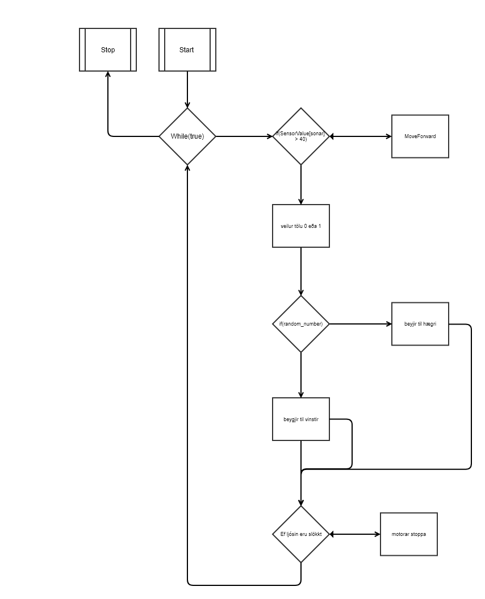

# Verkfni 4

## Verkefni 4

Verkefni 4 var ekki það erfitt. En eina sem stoppaði okkur þar var beyja 90°. Robotinn beygði alltaf milli 80 - 120°. Náðum að laga það, en þegar við notum Gyroscope vikraði það mun betur.
Svo notuðum við drive_straight fallið með smá breytingu, við breyttum því í task og létum að virka þannig að það keyrir þangað til að við seigjum annað.

#### Flowchart

#### Myndband

