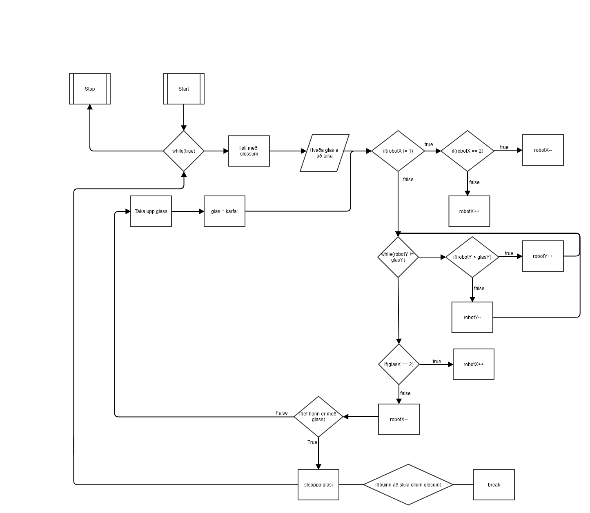

# Verkefni 6

## Lýsing
Verkefni 6 áhvöðum við að taka það aðeins lengar. Við vildum að robotinn okkar mundi taka input frá notandanum sem mundi ráða hvað glas robotinn a að taka.

## Vinna

við lantum í mikklum vesenni með þetta verkefni. Langdinar voru ekki alltaf nákvæmar sem lét line followerana ekki alltaf hitta á línurnar.
Það tók tíma að búa til forrit fyrir line followerana, það virkaði einu sinni en svo sem er sýnt í efra videoinu.
Við þurftum að hugsa um betri laust sem vað að láta line followerana ekki stórna þegar robotinn var búinn að fara 45cm. Þetta vikraði vel og það sést í neðra myndbandinu.

#### Flowchart

#### Myndband

#### Myndband

